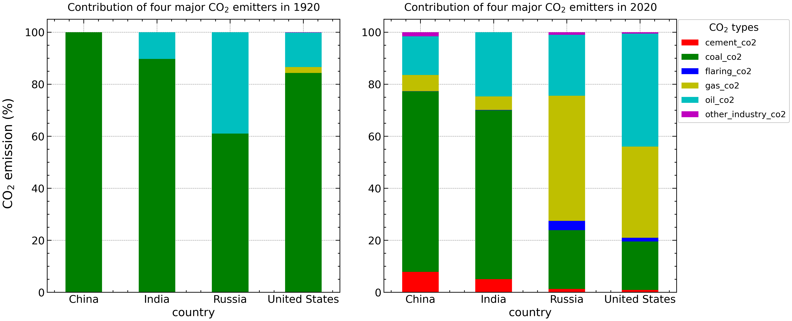
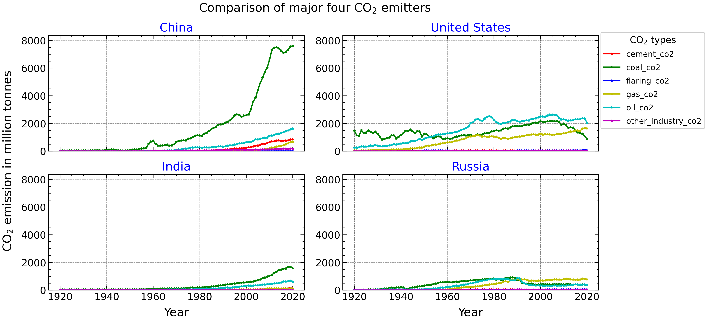

### **ReDI School of Digital Integration**
**Semester:** Winter 2022  
**Course:** Data Analytics  
**Project title:** Data Analysis of emissions from CO2 and other greenhouse gas 

### **My Task:**
- Analysis of CO2 sources for four major emitters e.g China, India, Russia and United States
- The CO2 data used are the annual total (territorial emissions) production-based emissions in million tonnes, excluding land-use change and traded goods.
- Source of data: [Our World in Data](https://github.com/owid/co2-data)

### **Sample results**
##### Total production-based CO2 emission

##### Contribution of four major CO2 emitters for the year 1920 and 2020

##### Contribution of four major CO2 emitters from 1920 to 2020

